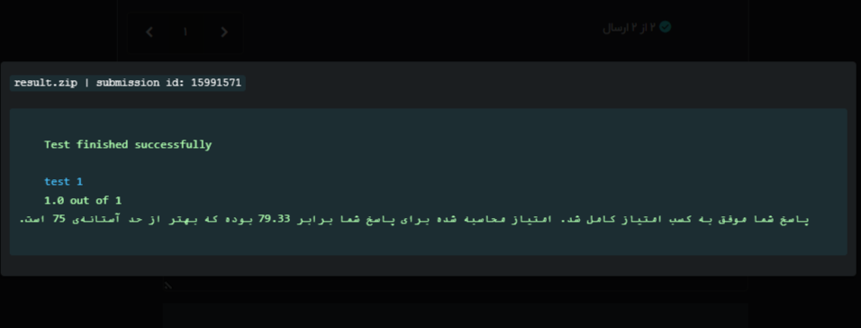

# Gender Prediction from Social Media Data

This project aims to predict the gender of users based on data provided by Twitter and Instagram. The dataset includes various features such as follower count, following count, and user biography, which are used to build predictive models.

## Introduction

In this exercise, we use data from Twitter and Instagram users to predict their gender. The dataset includes features like follower count, following count, user biography, and more. The goal is to build a machine learning model that can accurately predict the gender of users based on these features.

## Technical Steps

### 1. Data Loading and Preprocessing
- **Data Loading**: Load the training and test datasets using pandas.
- **Label Encoding**: Encode the gender labels using `LabelEncoder`.
- **Handling Missing Values**: Remove rows with missing values.
- **Feature Engineering**: Create new features such as `followers_to_following_ratio`.

### 2. Feature Binning and Encoding
- **Binning**: Categorize follower and following counts into bins (e.g., 'low', 'medium', 'high').
- **Ordinal Encoding**: Encode the binned features using `LabelEncoder`.

### 3. Text Feature Extraction
- **TF-IDF Vectorization**: Extract text features from user biography, username, and fullname using `TfidfVectorizer`.

### 4. Model Training and Evaluation
- **Text-Based Model**: Train an `XGBClassifier` on text features to predict gender.
- **Feature Combination**: Combine text-based predictions with other features for final model training.
- **Model Training**: Train an `XGBClassifier` on the combined features.
- **Model Evaluation**: Evaluate the model using metrics like F1-score.

## Conclusion

This project demonstrates the application of various machine learning techniques to predict user gender based on social media data. The final model aims to achieve high accuracy and generalizability.
